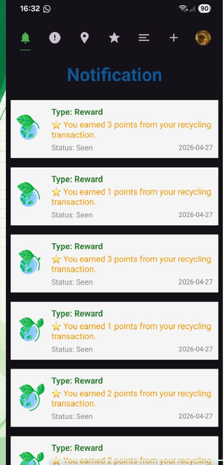
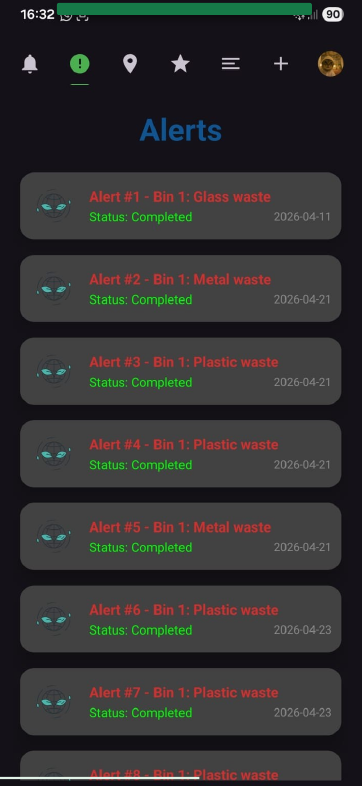
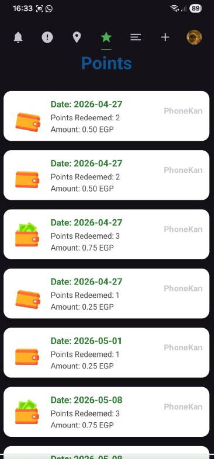
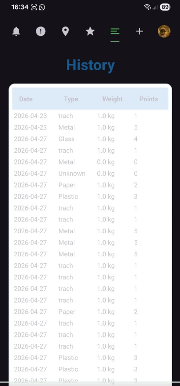
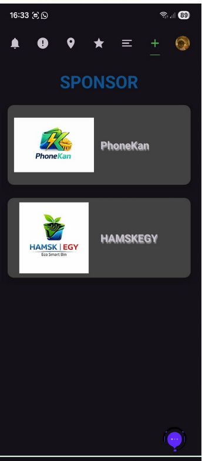

# ♻️ Eco Smart Bin

An Android application built with **Kotlin** as part of a Smart Waste Management System. The app enables users to recycle using smart bins, earn reward points, redeem rewards, receive real-time notifications, and locate nearby smart bins through a modern and intuitive user experience.

---

## Features

- 🔐 **Authentication**
  - Email/Password Login & Sign Up
  - Google Sign-In
  - Email Verification

- ♻️ **Smart Recycling**
  - QR Code generation
  - QR Code scanning
  - Smart bin interaction
  - Waste disposal tracking

- 🎁 **Reward System**
  - Earn points after recycling
  - Convert points into rewards
  - Redeem earned points
  - Transaction history

- 🔔 **Notifications**
  - Real-time push notifications
  - Bin status updates
  - Reward notifications

- 📍 **Nearby Smart Bins**
  - View nearby garbage bins
  - Location support

- 👤 **Profile**
  - View and edit profile
  - Logout
  - Session management

- 🌙 **Dark/Light Theme Support**

---

## Technologies

- Kotlin
- Android Studio
- MVVM Architecture
- Retrofit
- Firebase Authentication
- Firebase Cloud Messaging (FCM)
- Google Sign-In
- Room Database
- SharedPreferences
- ZXing QR Scanner
- Glide
- ViewBinding
- Material Design
- Lottie Animation

---

## 📸 Screenshots

| Notifications | Alerts | Nearby Bins |
|--------------|--------|-------------|
|  |  |  |

| Points | Redeem Points | History |
|--------|---------------|---------|
|  |  |  |

| Profile QR | Worker Profile | Worker Notifications |
|------------|----------------|----------------------|
|  |  |  |

| Sponsors |
|-----------|
|  |
---

## Project Highlights

- Smart recycling management
- QR Code based identification
- Reward points & redeem system
- Real-time notifications
- REST API integration
- Secure Firebase Authentication
- Clean MVVM Architecture
- Modern Material Design UI

---

---

## 👨‍💻 Developer

**Ahmed Hisham**

Computer Engineering Student  
Android Developer (Kotlin)

⭐ If you like this project, don't forget to give it a star!