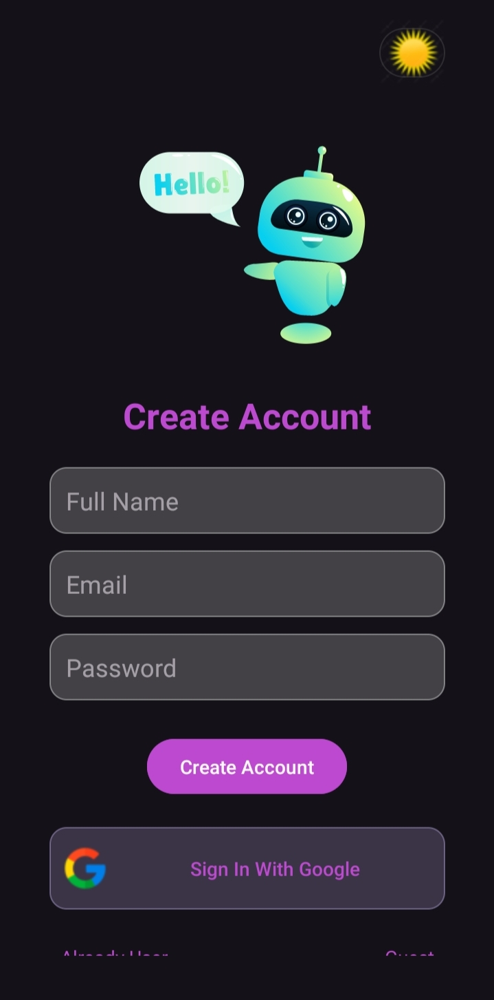
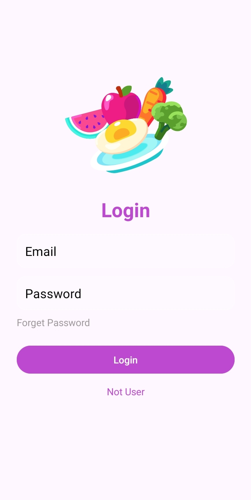
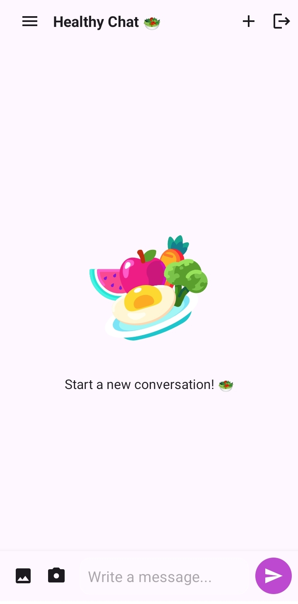
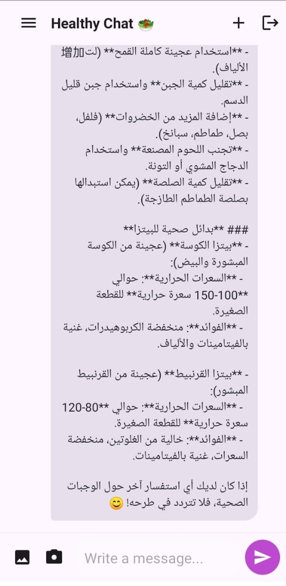

# 🥗 Healthy Food AI Chatbot

A modern Android application developed using **Kotlin**, **Firebase**, and **AI** that allows users to chat with an intelligent assistant and receive personalized healthy meal recommendations based on their fitness goals.

---

## Features

- 🔐 **Authentication**
  - Email/Password Login & Sign Up
  - Google Sign-In integration
  - Email Verification

- 🤖 **AI Chat**
  - Real-time conversation with AI
  - Personalized healthy meal recommendations
  - Nutrition suggestions based on user goals

- 💬 **Chat History**
  - Save conversations locally
  - Offline access to previous chats
  - Room Database integration

- 🎨 **User Experience**
  - Smooth chat interface
  - Lottie animations
  - Custom animated Toast messages
  - Dark/Light Theme Support

---

## Technologies

- Kotlin
- Android Studio
- MVVM Architecture
- Firebase Authentication
- Firebase Firestore
- Google Sign-In
- Room Database
- Mistral AI API
- ViewBinding
- SharedPreferences
- Material Design
- Lottie Animation

---

## Screenshots

