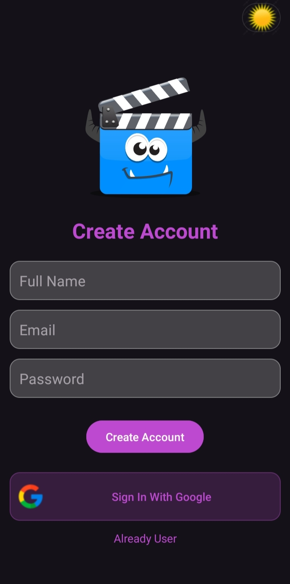
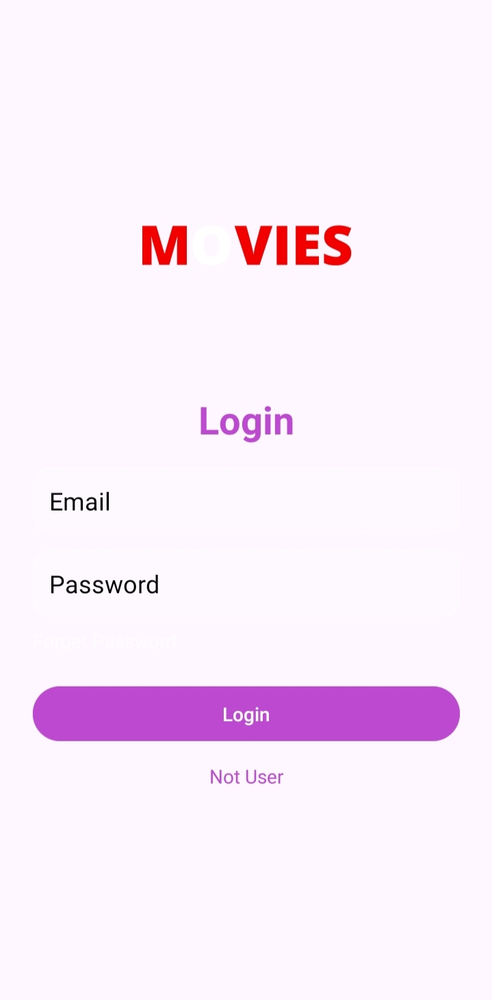
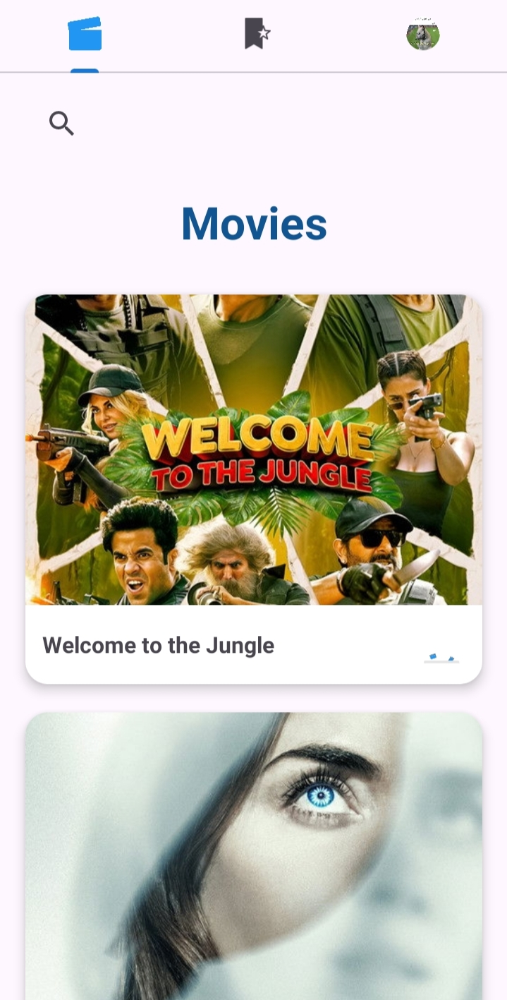
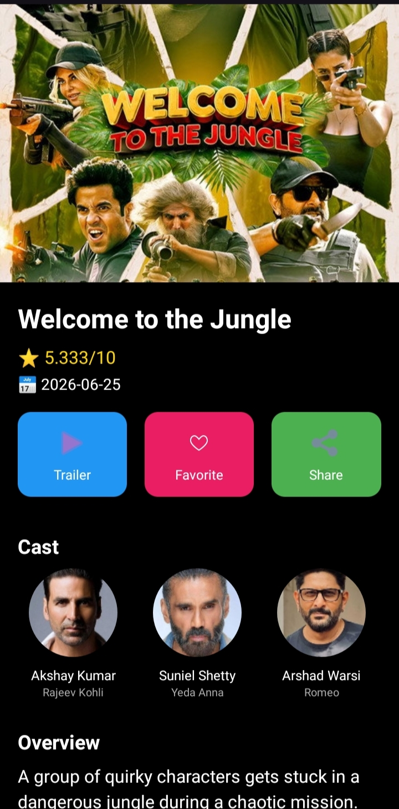
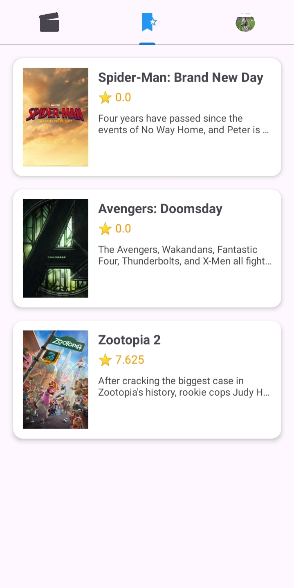
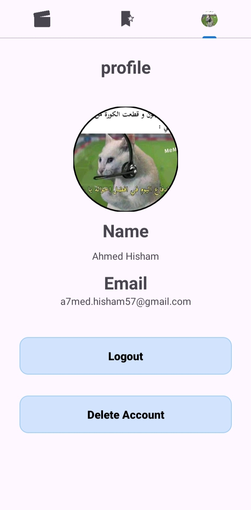

# Movies App

A modern Android application developed using **Kotlin** that allows users to browse, search, and discover movies with a sleek and interactive interface.

---

## Features

- 🔐 **Authentication**
  - Email/Password Login & Sign Up
  - Google Sign-In integration

- 🎥 **Movie Browsing**
  - Browse trending movies
  - Search for movies
  - View movie details (story, cast, ratings)

- ❤️ **Favorites**
  - Add/Remove movies to favorites
  - View favorite movies list

- 👤 **Profile**
  - View user profile
  - Logout
  - Delete account

- 🌙 **Dark/Light Theme Support**

---

## Technologies

- Kotlin
- Android Studio
- MVVM Architecture
- Retrofit
- Glide
- Firebase Auth
- Room Database
- DataBinding
- Material Design
- Lottie Animation

---

## Screenshots

