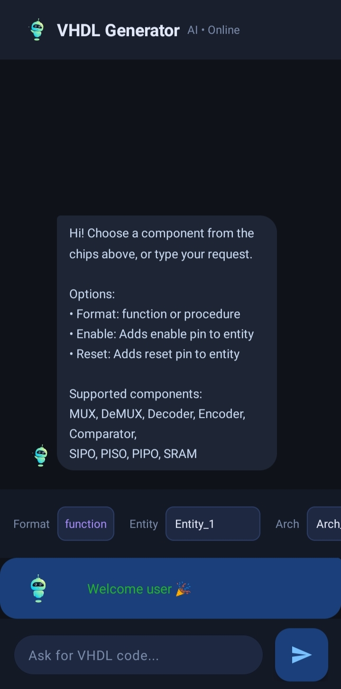
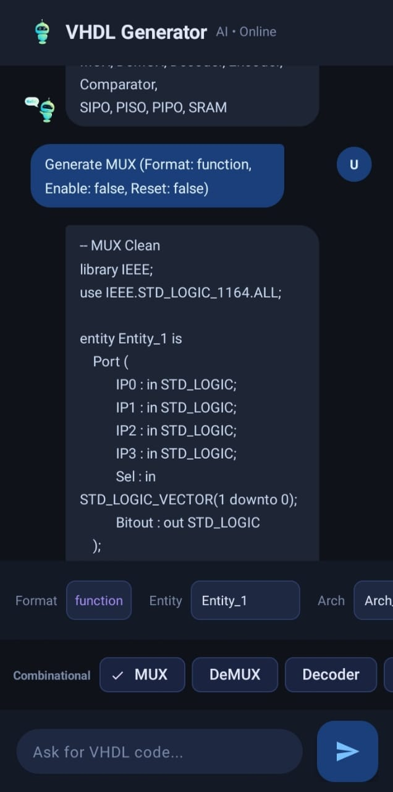
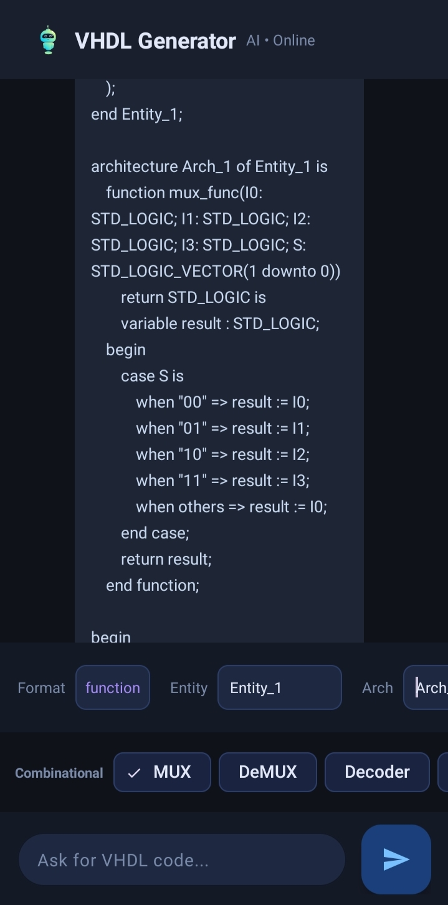
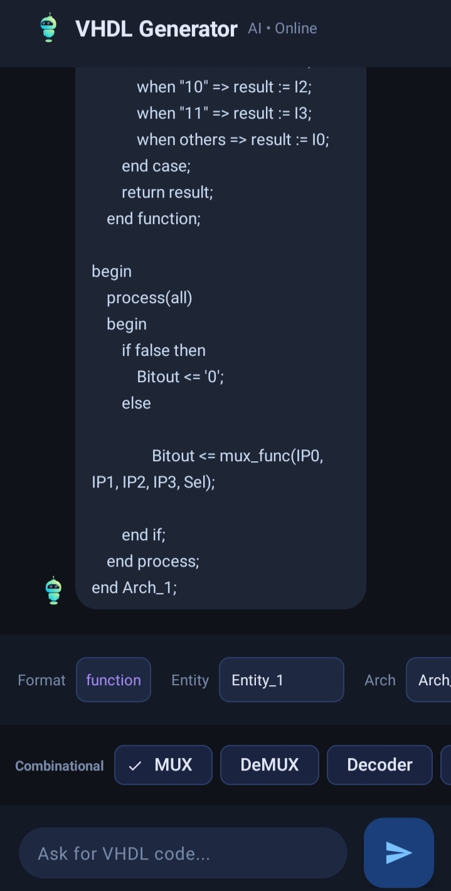

# VHDL Code Generator

A modern Android application developed using **Kotlin** that generates VHDL code for common digital logic components through an interactive chatbot interface.

## Features

- Generate VHDL code for:
  - Multiplexer (MUX)
  - Demultiplexer (DeMUX)
  - Decoder
  - Encoder
  - Comparator
  - SRAM
  - Shift Registers
    - SIPO
    - PISO
    - PIPO

- Supports different output formats:
  - Standard Architecture
  - Function
  - Procedure

- Optional Enable and Reset signals.

- Interactive chatbot interface.

- Bottom Sheet configuration for each component.

- Beautiful Material Design UI.

- Animated welcome screen using Lottie.

---

## Technologies

- Kotlin
- Android Studio
- ViewBinding
- RecyclerView
- BottomSheetDialogFragment
- Material Design
- Lottie Animation

---
s

