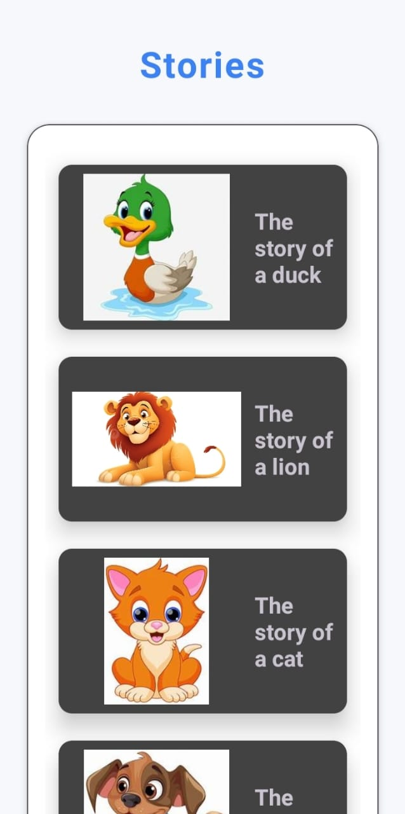
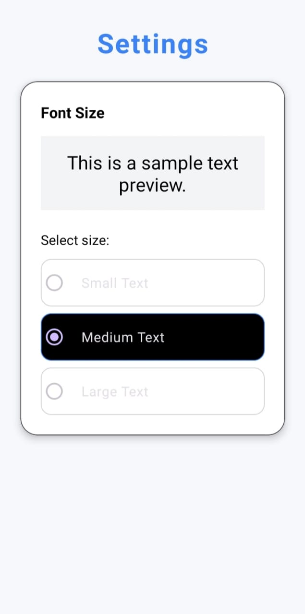
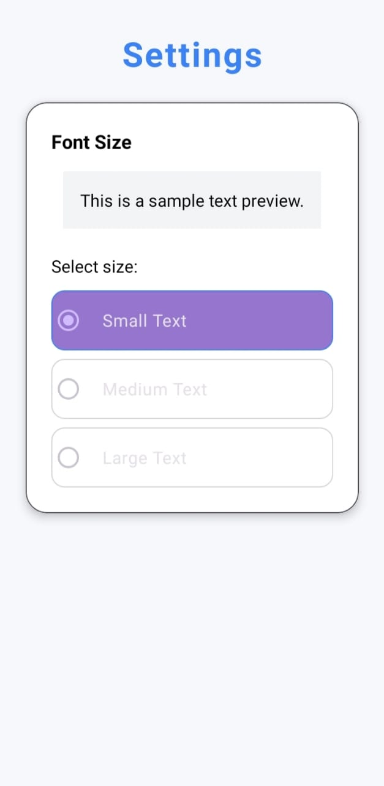
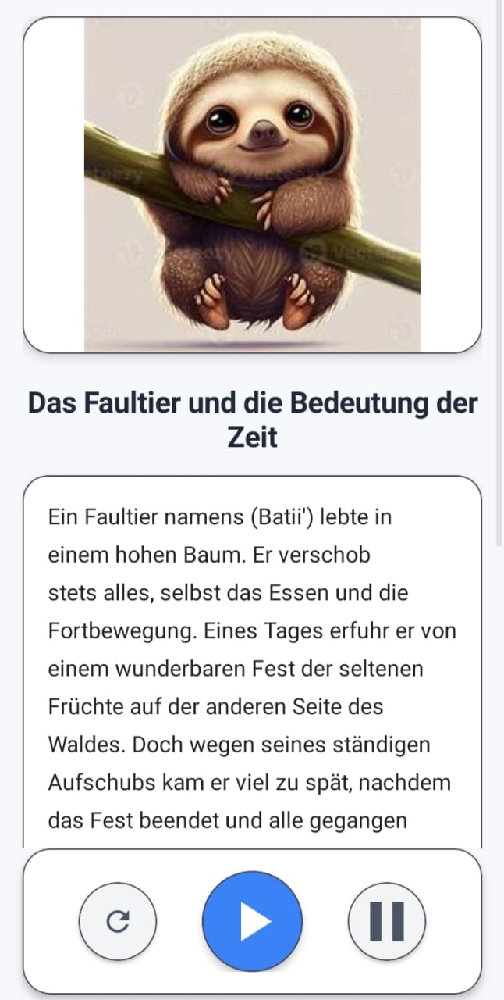

# Kids Stories App 

Interactive kids stories app with animals, images, sounds, and text-to-speech support.

The app helps children enjoy stories by listening, reading, and watching images change automatically.

---

##  Features

-  Multiple kids stories with animals  
-  Auto image slider (images change every 3 seconds)  
-  Text To Speech (TTS) with:
  - Play / Pause support  
  - Resume reading from the last word  
  - Smooth continuous speech (no word cutting)  
-  Highlighting words while the voice is reading  
-  Multi-language support (English, Arabic, French, German)  
-  Real animal sounds (3 seconds each)  
-  Adjustable text size  

---

## Technologies Used

- **Kotlin**
- **RecyclerView**
- **ViewPager2**
- **TextToSpeech (TTS)**
- **MediaPlayer**
- **Coroutines**
- **firebaseStore** 

---

##  Screenshots

